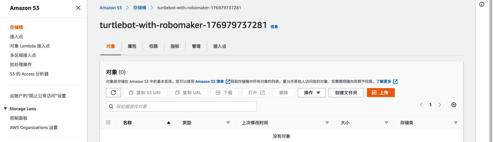

**使用Robomaker进行机器人强化训练**

强化学习 (RL) 是一种高级机器学习 (ML) 技术，无需任何标记的训练数据即可学习非常复杂的行为，并且可以在针对长期目标进行优化的同时做出短期决策。 

使用 AWS RoboMaker 示例应用程序生成用于 RL 的模拟训练数据。  RL 模型将教机器人跟踪和跟随物体。  这是一个简单的演示，可以扩展到用例，例如仓库中的工人协助或在家中跟随消费者的娱乐机器人。 

在这个Demo中，您将完成构建机器人应用程序的步骤。此应用程序将使用强化学习来训练机器人（以 TurtleBot 3 Waffle Pi 为例）自动驾驶到静止的机器人（以 TurtleBot 3  Burger 为例），在 AWS RoboMaker 模拟中训练和评估强化学习模型，并使用 AWS RoboMaker  车队管理将该模型部署到物理机器人。 

该Demo包含以下内容：

- 创建 S3 存储桶、IAM 角色和策略 
- 使用 AWS Cloud9 设置 AWS RoboMaker 开发环境 
- 使用 AWS RoboMaker 模拟来训练强化学习模型并可视化应用程序 
- 通过仿真评估模型 
- 将模型部署到机器人 

# 1、环境准备

## 1.1 选择Region

该ROS应用程序可以部署在任何支持 AWS RoboMaker 服务的 AWS 区域。 

## 1.2 创建S3存储桶

在Amazon S3  控制台创建一个存储桶，该存储桶用于存储经过训练的强化学习模型和模拟日志。为存储桶命名为“turtlebot-with-robomaker-176979737281”，其他配置保留默认。

